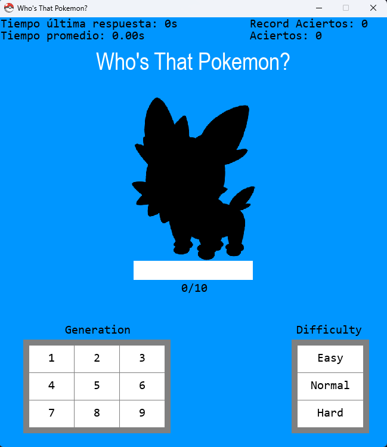

# Proyecto "Who's That Pokemon??" con Pygame

## Visión general

"Who's That Pokemon??" es un juego desarrollado en Python inspirado en el popular segmento del mismo nombre de la serie animada Pokémon. Los jugadores deben identificar correctamente a Pokémon a partir de una imagen de su silueta mostrada en pantalla. El juego ofrece opciones para seleccionar generaciones específicas de Pokémon y ajustar los niveles de dificultad de las imágenes para aumentar la variedad y desafío del juego.

## Características

- **Jugabilidad de Adivinanzas**: Los jugadores identifican Pokémon a partir de una silueta mostrada en pantalla.
- **Opciones Personalizables**:
  - **Generaciones**: Elige entre varias generaciones de Pokémon.
  - **Niveles de Dificultad**: Ajusta la dificultad de la silueta para adivinar (fácil, medio, difícil).
- **Interfaz Interactiva**: Utiliza Pygame para gráficos e interacción con el usuario.
- **Estadísticas y Registros**: Registra el rendimiento del jugador con estadísticas como mejor tiempo, peor tiempo, tiempo promedio y número más alto de respuestas correctas.
- **Integración de API**: Utiliza informacion de la PokeAPI para obtener imágenes, nombres y generaciones de Pokémon.

## Estructura del Proyecto

El proyecto está organizado en varios módulos y estructuras de archivos:

- **Script Principal**: Controla el ciclo de juego, manejo de eventos y renderización de pantalla.
- **Módulos**:
  - **Classpokemon.py**: Contiene clases relacionadas con objetos Pokémon, incluyendo métodos para dibujar y filtrar Pokémon según la generación.
  - **Classbotones.py**: Gestiona la creación y renderización de botones para seleccionar generaciones y niveles de dificultad.
  - **Classanimacion.py**: Maneja la animación de imágenes de Pokémon.
  - **Archivos.py**: Proporciona funciones para leer y escribir datos en archivos JSON, TXT y CSV.
- **Archivos de Datos**:
  - **pokemons.csv**: Almacena una lista de datos de Pokémon, incluyendo nombres y generaciones.
  - **pokemon_names_multilang.csv**: Contiene nombres de Pokémon en varios idiomas.
  - **record_aciertos.txt**: Registra el número más alto de respuestas correctas.
  - **estadisticas.json**: Almacena estadísticas del juego como tiempos de rendimiento y puntajes.

## Tecnologías Utilizadas

- **Python**: Lenguaje de programación utilizado para la lógica del juego y la interfaz.
- **Pygame**: Biblioteca de Python para desarrollar aplicaciones multimedia como juegos.

## Total de Pokémon Disponibles

El juego incluye 1119 Pokémon obtenidos de PokeAPI, asegurando una amplia variedad de personajes para que los jugadores los adivinen.

## Cómo Jugar

1. **Iniciar el Juego**: Ejecutar la aplicación del juego.
2. **Seleccionar Opciones**:
   - Elegir generaciones de Pokémon y nivel de dificultad.
3. **Adivinar el Pokémon**:
   - Observa la silueta y escribe tu respuesta.
4. **Seguir el Rendimiento**:
   - Mantén un seguimiento de estadísticas como tu mejor tiempo, número de respuestas correctas, y más.

## Conclusión

"¿Quién es ese Pokémon?" ofrece una experiencia de juego divertida e interactiva para entusiastas de Pokémon de todas las edades. Con sus opciones personalizables e integración con PokeAPI, proporciona una experiencia de juego rica mientras desafía el conocimiento y habilidades de reconocimiento de Pokémon de los jugadores.